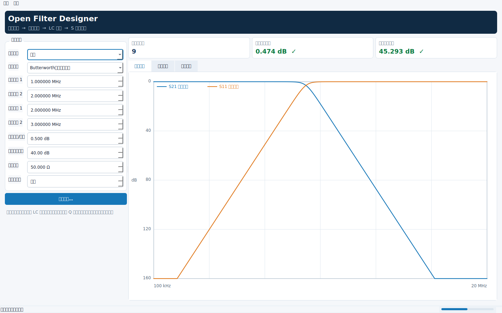

# Open Filter Designer

一个参考 **Ansys Nuhertz FilterSolutions 工作流与功能边界**、但从零独立实现的 Python 滤波器设计程序。项目不包含、复制或反编译任何 Ansys 源码、专有算法、商标素材或界面资源。

当前版本实现一条完整且可验证的无源集总滤波器工作流：

> 规格输入 → 自动计算阶数 → 归一化原型综合 → LC 电路变换 → ABCD/S 参数分析 → 指标验证 → 工程与仿真文件导出


## 界面预览



## 已实现功能

- **响应类型**：低通、高通、带通、带阻。
- **近似类型**：Butterworth、Chebyshev I。
- **自动阶数**：根据通带纹波、阻带衰减和边缘频率计算最低阶数，也可固定阶数。
- **电路综合**：生成理想 LC 梯形网络；带通/带阻自动展开串联或并联谐振器。
- **独立验证**：从实际元件网络级联 ABCD 矩阵，计算完整的 S11、S21、S12、S22、插入损耗、回波损耗、相位和群延迟。
- **Qt 桌面应用**：使用 PySide6 构建原生跨平台界面，包含中文规格面板、指标卡片、响应绘图、电路拓扑和元件表。
- **响应式计算**：综合和扫频通过 `QThread` 在后台执行，避免阻塞界面。
- **命令行工具**：适合脚本、批处理和 CI。
- **工程文件**：版本化 JSON 保存/打开。
- **导出**：CSV、Touchstone `.s2p`、SPICE `.cir`、HTML 报告。
- **内核轻量化**：综合与分析内核只使用 Python 标准库；仅桌面界面依赖 PySide6。

## 快速开始

要求 Python 3.11 或更高版本。安装会自动获取 Qt for Python（PySide6）：

```bash
python -m pip install -e .
filter-design-gui
```

也可以不安装，直接从源码运行：

```bash
python -m pip install "PySide6>=6.8,<7"
PYTHONPATH=src python -m filter_design.ui.app
```

### 命令行示例

设计一个 1 MHz 通带边缘、2 MHz 阻带边缘、0.5 dB/40 dB 指标的低通滤波器：

```bash
PYTHONPATH=src python -m filter_design.cli \
  --response lowpass \
  --approximation butterworth \
  --passband 1000000 \
  --stopband 2000000 \
  --ripple 0.5 \
  --attenuation 40
```

设计带通并导出全部结果：

```bash
PYTHONPATH=src python -m filter_design.cli \
  --response bandpass \
  --approximation chebyshev1 \
  --passband 1000000 2000000 \
  --stopband 500000 3000000 \
  --ripple 0.5 \
  --attenuation 40 \
  --export-prefix output/bandpass
```

这会生成：

- `bandpass.csv`：采样响应；
- `bandpass.s2p`：二端口 S 参数；
- `bandpass.cir`：SPICE 网表；
- `bandpass.html`：设计报告；
- `bandpass.ofd.json`：可重新载入的工程文件。

使用 `--json` 可获得便于程序处理的设计摘要。使用 `--help` 查看全部参数。

## 桌面工作流

1. 在左侧“设计指标”面板选择响应类型和逼近函数。
2. 以 MHz 输入通带与阻带边缘，并设置纹波、衰减、阻抗和自动/固定阶数。
3. 点击 **综合并分析**；Qt 后台线程执行计算，进度条显示忙碌状态。
4. 从顶部指标卡片读取阶数、通带损耗和阻带衰减是否达标。
5. 在“频率响应”“电路拓扑”“元件列表”三个页签检查结果。
6. 从“文件”菜单保存工程，或导出 CSV、Touchstone、SPICE 和 HTML。
7. 窗口尺寸和最近使用目录通过 `QSettings` 自动保存。

## 数学与电路约定

- 原型从串联元件开始，奇数 `gk` 为串联电感，偶数 `gk` 为并联电容。
- Butterworth 原型按用户通带衰减对临界频率进行缩放，而不是把通带边缘固定解释为 3 dB 截止点。
- Chebyshev I 的经典偶数阶梯形原型具有不等端接。自动模式为保持用户指定的等端接，会提升到下一个奇数阶并给出诊断；固定偶数阶仍允许用于研究，但指标面板会真实显示偏差。
- 带通和带阻的两个谐振元件均保留在结构化网络中。
- 当前所有元件都是理想、无损元件。输出不能代替制造前的 Q 值、寄生参数、容差、功率和布局验证。

## 项目结构

```text
src/filter_design/
├── domain/          # 规格、工程、电路和结果对象
├── synthesis/       # 阶数、原型系数、频率/阻抗变换
├── analysis/        # ABCD、S 参数、扫频和指标测量
├── exporters/       # CSV、Touchstone、SPICE、HTML
├── ui/              # PySide6/Qt 桌面应用、绘图、模型与后台工作器
├── cli.py           # 命令行入口
└── workflow.py      # 与 UI 无关的完整设计流程
tests/               # 数值、变换、持久化和导出测试
```

详细设计和后续边界见 [`docs/architecture.md`](docs/architecture.md) 与 [`docs/roadmap.md`](docs/roadmap.md)。

## 测试

```bash
QT_QPA_PLATFORM=offscreen pytest -q
python -m compileall -q src tests
```

## 与商业软件的边界

本项目只借鉴通用的工程工作流与公开的经典滤波器理论。它不是 Ansys 产品，不与 Ansys、Nuhertz 或 FilterSolutions 存在隶属、授权或兼容性承诺。Ansys、Nuhertz 和 FilterSolutions 是其各自权利人的名称或商标。

## License

MIT，见 [`LICENSE`](LICENSE)。
