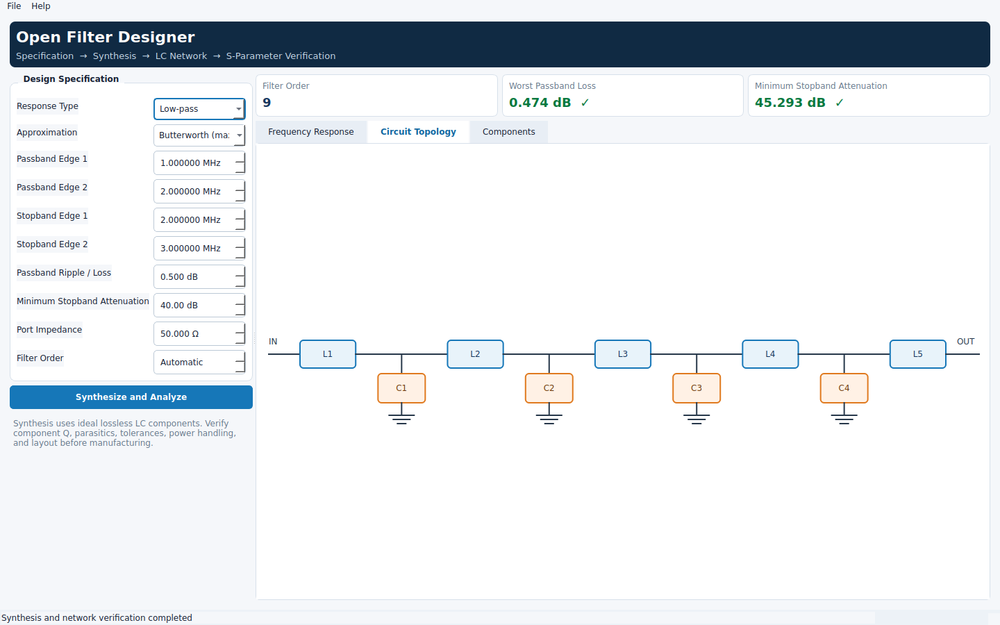
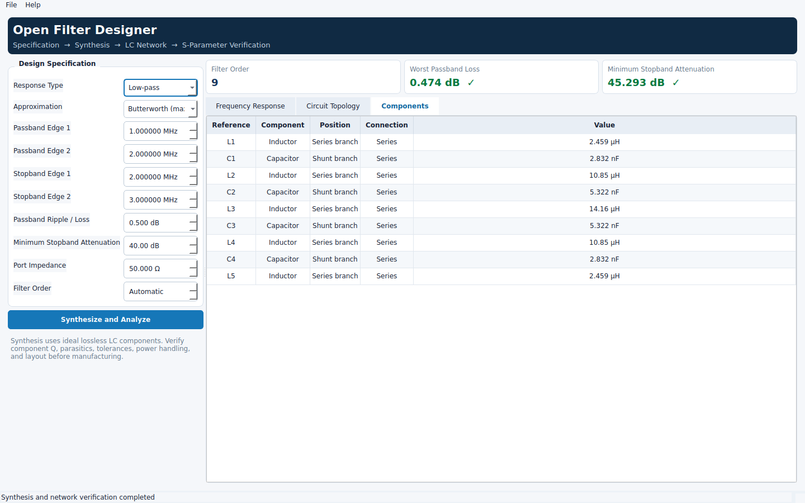
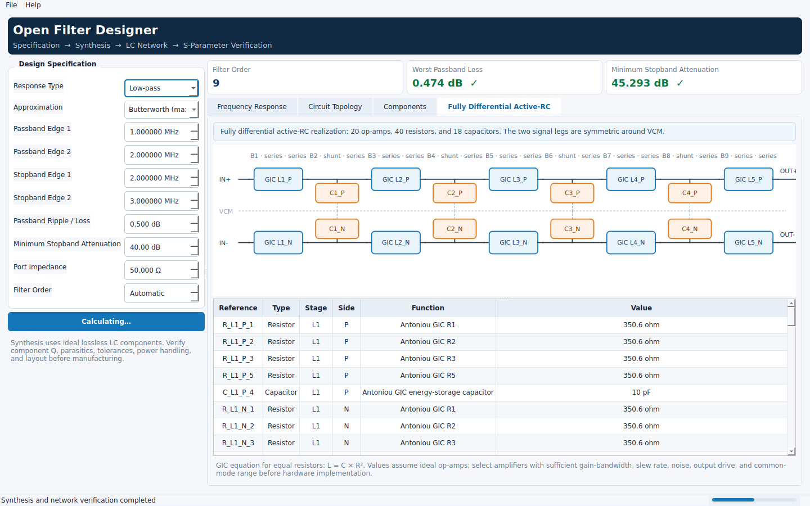
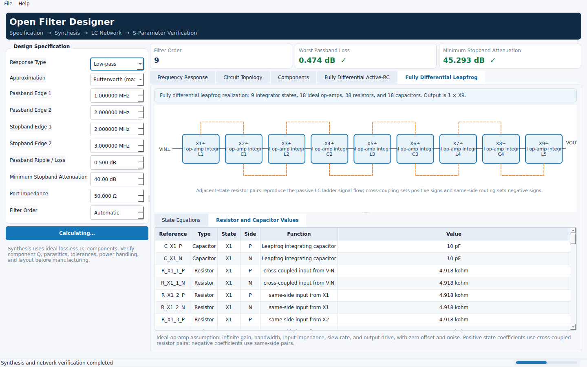

# Open Filter Designer

Open Filter Designer is an independent, from-scratch Python implementation inspired by the general workflow and product boundaries of Ansys Nuhertz FilterSolutions. It does not contain, copy, or reverse-engineer any Ansys source code, proprietary algorithms, trademarks, or interface assets.

The current release implements a complete and verifiable passive lumped-filter workflow:

> Specification → minimum order → normalized prototype → LC transformation → ABCD/S-parameter analysis → verification → project and simulation exports


## Interface Preview

### Frequency Response


### Circuit Topology



### Components



### Fully Differential Active-RC



### Fully Differential Leapfrog



## Features

- **Responses:** low-pass, high-pass, band-pass, and band-stop.
- **Approximations:** Butterworth and Chebyshev I.
- **Automatic order:** calculates the minimum order from passband ripple, stopband attenuation, and edge frequencies; fixed orders are also supported.
- **Circuit synthesis:** generates ideal LC ladders and expands band-pass/band-stop elements into series or parallel resonators.
- **Independent verification:** cascades the generated component network as ABCD matrices and calculates S11, S21, S12, S22, insertion loss, return loss, phase, and group delay.
- **Qt desktop application:** a native PySide6 interface with a specification panel, metric cards, response plot, circuit view, and component table.
- **Fully differential active-RC realization:** replaces every inductor with mirrored Antoniou GIC cells and reports the required op-amp, resistor, and capacitor values.
- **Fully differential leapfrog realization:** exactly simulates a low-pass LC ladder with interleaved ideal-op-amp integrators and lists every coupling resistor and integrating capacitor.
- **Responsive analysis:** synthesis and frequency sweeps run in a background `QThread` without blocking the UI.
- **Command-line interface:** suitable for scripts, batch processing, and CI.
- **Project files:** versioned JSON save/load support.
- **Exports:** CSV, Touchstone `.s2p`, SPICE `.cir`, and standalone HTML reports.
- **Lightweight core:** synthesis and analysis use only the Python standard library; PySide6 is required only for the desktop UI.

## Quick Start

Python 3.11 or later is required. Installing the project also installs Qt for Python:

```bash
python -m pip install -e .
filter-design-gui
```

To run directly from the source tree:

```bash
python -m pip install "PySide6>=6.8,<7"
PYTHONPATH=src python -m filter_design.ui.app
```

### Command-Line Example

Design a low-pass filter with a 1 MHz passband edge, a 2 MHz stopband edge, and 0.5 dB / 40 dB requirements:

```bash
PYTHONPATH=src python -m filter_design.cli \
  --response lowpass \
  --approximation butterworth \
  --passband 1000000 \
  --stopband 2000000 \
  --ripple 0.5 \
  --attenuation 40
```

Design a band-pass filter and export all supported formats:

```bash
PYTHONPATH=src python -m filter_design.cli \
  --response bandpass \
  --approximation chebyshev1 \
  --passband 1000000 2000000 \
  --stopband 500000 3000000 \
  --ripple 0.5 \
  --attenuation 40 \
  --export-prefix output/bandpass
```

This creates:

- `bandpass.csv`: sampled response data;
- `bandpass.s2p`: two-port S-parameters;
- `bandpass.cir`: SPICE netlist;
- `bandpass.html`: design report;
- `bandpass.ofd.json`: reloadable project file.

Use `--json` for a machine-readable design summary and `--help` for all options.

## Desktop Workflow

1. Select a response type and approximation in the **Design Specification** panel.
2. Enter passband and stopband edges in MHz, then set ripple, attenuation, impedance, and automatic or fixed order.
3. Select **Synthesize and Analyze**. The calculation runs in a Qt worker thread while the UI shows progress.
4. Review filter order, worst passband loss, and minimum stopband attenuation in the metric cards.
5. Inspect the **Frequency Response**, **Circuit Topology**, **Components**, **Fully Differential Active-RC**, and **Fully Differential Leapfrog** tabs.
6. Use the **File** menu to save the project or export CSV, Touchstone, SPICE, and HTML files.
7. Window geometry and the most recently used directory are persisted with `QSettings`.

## Mathematical and Circuit Conventions

- Prototypes begin with a series element: odd `gk` values map to series inductors and even `gk` values map to shunt capacitors.
- Butterworth critical frequency is scaled to the requested passband attenuation instead of treating the passband edge as a fixed 3 dB cutoff.
- A classic even-order Chebyshev-I ladder has unequal terminations. Automatic equal-termination synthesis promotes an even minimum order to the next odd order and reports a diagnostic. A fixed even order remains available for investigation, while verification reports the actual mismatch.
- Both resonator components remain explicit in band-pass and band-stop network models.
- Components are ideal and lossless. Output does not replace pre-manufacturing verification of Q, parasitics, tolerances, power handling, and physical layout.
- The fully differential active-RC view splits every impedance equally between the positive and negative legs. A capacitor becomes two `2C` capacitors, while each inductor becomes two `L/2` Antoniou GIC cells using `L = C × R²`. The listed values assume ideal op-amps and a stiff common-mode reference.
- The fully differential leapfrog view currently supports low-pass alternating series-L/shunt-C ladders. It scales inductor currents by the port impedance so all states have voltage units, then implements each state coefficient with `R = 1/(|a|Cint)`. Positive terms are cross-coupled and negative terms are routed same-side into ideal differential inverting integrators.

## Project Layout

```text
src/filter_design/
├── domain/          # Specifications, projects, circuits, and result objects
├── synthesis/       # Order, prototype coefficients, and frequency/impedance transforms
├── realization/     # Fully differential op-amp-RC and future physical realizations
├── analysis/        # ABCD, S-parameters, sweeps, and verification metrics
├── exporters/       # CSV, Touchstone, SPICE, and HTML
├── ui/              # PySide6/Qt application, plots, models, and worker
├── cli.py           # Command-line entry point
└── workflow.py      # UI-independent design workflow
tests/               # Numerical, transform, persistence, export, and Qt tests
```

See [`docs/architecture.md`](docs/architecture.md) and [`docs/roadmap.md`](docs/roadmap.md) for design details and future product boundaries.

## Testing

```bash
QT_QPA_PLATFORM=offscreen pytest -q
python -m compileall -q src tests
```

## Commercial Product Boundary

This project uses public, classical filter theory and a general engineering workflow. It is not an Ansys product and makes no claim of affiliation, authorization, or compatibility with Ansys, Nuhertz, or FilterSolutions. Those names and trademarks belong to their respective owners.

## License

MIT. See [`LICENSE`](LICENSE).
